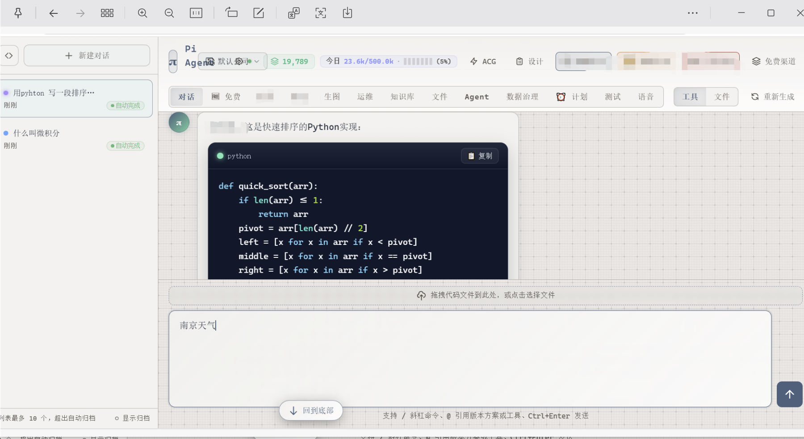
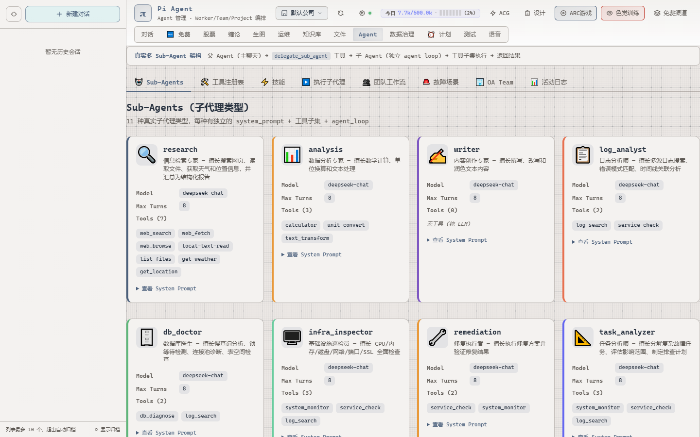
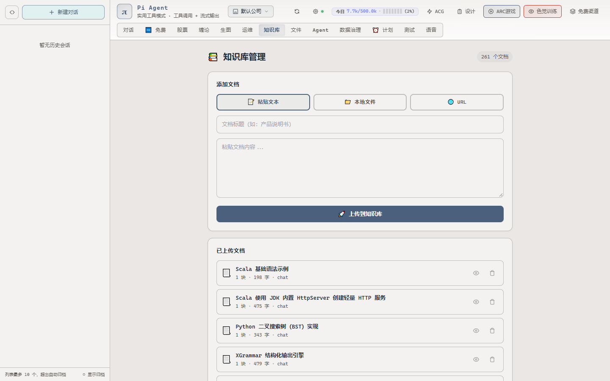
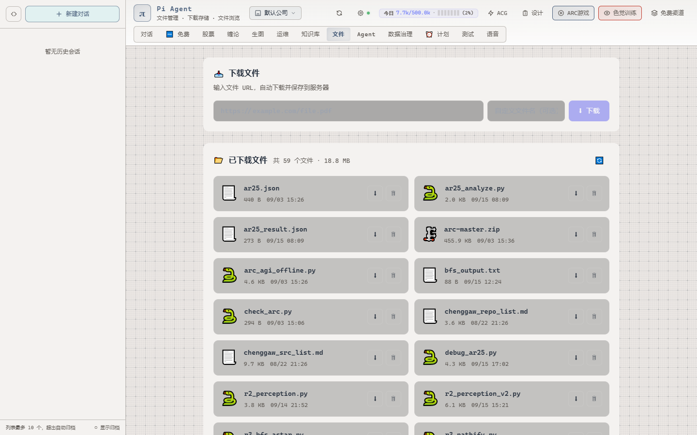
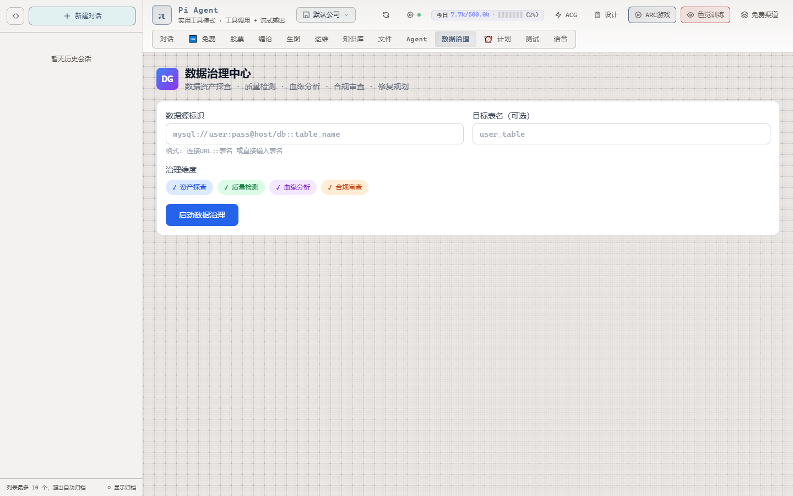

# Pi Agent — 项目文档

> 版本 v0.3.0 · 提交用材料 · 生成时间 2026-09-26
> 本文档中每一条量化数字与行号均在本轮实测/复读后写入；未复核的推断一律标注"未证实"。

---

## 1. 一句话简介

Pi Agent 是一个**自托管的全栈 Agent 服务**：FastAPI 单体后端 + React 前端，把
「工具调用 / 技能路由 / 三层短期记忆 / 向量长期记忆 / NDJSON 流式协议 / 子代理编排」
六件事做进了同一个可离线运行的进程里，并在其上长出了对话、股票、缠论、生图、运维、
知识库、文件、Agent 管理台、数据治理、计划、语音、3D 视觉训练等 14 个业务视图。

- 代码规模（本轮实测）：后端核心 14 个文件 **12,031 行**（`app.py` 单文件 4,331 行、129 条 `@app.*` 路由）；前端 `frontend/src` **61 个 ts/tsx 文件 16,920 行** + `styles.css` 8,102 行。
- 运行形态：单机单进程，无外部中间件依赖（DB 用嵌入式 SQLite，向量检索用纯 Python 余弦）。
- 仓库：`C:\newtask-pi`，git 19 次提交，最新 `feb3803`（2026-09-17）。

---

## 2. 架构分层

```
┌─ 前端 React + Vite (frontend/src) ─────────────────────────────┐
│  hashRoute.ts 14 views + 2 overlays                            │
│  useChat.ts  NDJSON 读取器 · useConversations.ts · blocks/*    │
└──────────────────────────┬─────────────────────────────────────┘
                           │ POST /api/chat  →  NDJSON 流
┌──────────────────────────▼─────────────────────────────────────┐
│  app.py  FastAPI(title="Pi Agent", v0.1.0)   app.py:39         │
│  129 条路由 · 静态托管 static/dist                              │
└──────────────────────────┬─────────────────────────────────────┘
                           │
┌──────────────────────────▼─────────────────────────────────────┐
│  chat_service.py  入参归一 / 记忆注入           :204-214        │
│  chat_orchestrator.py  编排 + 重试 + 止损       :493-561        │
│  agent_loop.py  双层循环 · 并发工具执行         :228-261/:502   │
│  stream/protocol.py 23 种块 · lifecycle 单次收口               │
└──────┬───────────────────────┬──────────────────┬──────────────┘
       │                       │                  │
┌──────▼────────┐  ┌───────────▼─────────┐  ┌─────▼──────────────┐
│ tool_registry │  │ skill_registry      │  │ 记忆双层           │
│ 36 工具       │  │ 13 技能（懒加载）   │  │ thread_state 短期  │
│ OpenAI spec   │  │ 索引+缓存+mtime     │  │ memory_retrieval   │
└───────────────┘  └─────────────────────┘  │ 长期向量召回       │
                                            └────────────────────┘
```

| 层 | 落点 | 关键文件:行号 |
|---|---|---|
| 接入层 | FastAPI 单体 + 静态托管 | `app.py:39`（title/version）、`app.py:42`（`static/dist`） |
| 会话层 | 浏览器 session → 会话注册表 → thread | `app.py:260-266`（`GET /api/conversations`，`session_id` 必填） |
| 编排层 | 重试、止损、工具上限 | `chat_orchestrator.py:493`（`orchestrate_chat`）、`:53-55`（`MAX_TOOL_CALLS=8` / `MAX_RETRY_ATTEMPTS=3` / `RETRY_DELAY_S=2.0`） |
| 执行层 | 双层 Agent 循环、并发工具 | `agent_loop.py:150`（`max_turns: int = 20`）、`:502`（`await asyncio.gather(*[_run_single(tc) for tc in tool_calls])`） |
| 协议层 | 23 种 NDJSON 块 | `stream/protocol.py`（实测 `"type":` 字面量去重后 23 个） |
| 能力层 | 工具 / 技能 / 子代理 | `tools/__init__.py:44-79`（36 次 `register_*()`）、`skill_registry.py:182-186`（只索引顶层 `.md`） |
| 记忆层 | 短期三层 + 长期向量 | `thread_state.py:39-49`、`memory_retrieval.py:49-64` |
| 存储层 | 嵌入式 SQLite | `data/pi_agent.db`（4.2 MB，8 张表） |

---

## 3. 四大核心机制

### 3.1 工具系统（36 个已注册工具）

统一元数据模型 `ChatToolDefinition`：`name / description / parameters / execute /
format_input / format_output / result_is_authoritative / keywords /
planning_category / decision_weight`。注册表 `ToolRegistry` 提供
`register / get / has / list_tools / get_openai_tool_specs / execute / recommend_tool`，
全局单例在 `tool_registry.py:101`。

- 全仓库**唯一**产出 OpenAI function-calling 结构的地方是 `tool_registry.py:22-31`
  （`{"type":"function","function":{name,description,parameters}}`），模型侧协议收敛在一处。
- 实测注册数：`import tools` 后 `len(tool_registry.list_tools()) == 36`；
  `tools/__init__.py` 内 36 次 `register_*()` 调用与之一致。
- 工具覆盖面：计算/日期/文本/单位换算等本地工具，`web_search`/`web_fetch`/`web_browse`，
  文件下载与 `list_files`，股票 `stock_quote`/`stock_analysis`/`stock_search`，
  `chanlun_analysis`，`pdf_extract`，`youtube_analyze`/`wechat_article`/`github_repo`，
  运维 `service_check`/`log_search`/`system_monitor`，数据治理
  `db_schema_extract`/`data_sample`/`stat_profiler`/`quality_check`/`null_checker`/
  `outlier_detector`/`duplicate_detector`/`lineage_graph`/`sql_parser`/`impact_analysis`/
  `db_diagnose`，以及 `delegate_sub_agent`、`arc_agi`。
- `recommend_tool` + `keywords` + `planning_category` + `decision_weight` 构成"模型没选工具时"
  的兜底推荐通道，`result_is_authoritative` 用于标记工具结果可直接采信、不必再让模型复述。

### 3.2 技能路由（13 个技能，懒加载）

技能 = 一份带 YAML frontmatter 的 Markdown（`skills/*.md`），字段
`id / name / description / tool_names / output_policy / result_policy / routing_hints /
tags / fallback_policy / default`，用来把"一类任务该用哪几个工具、结果怎么呈现"从提示词里
抽出来变成可版本化的数据。

- 启动只建索引不读正文（`skill_registry.py:182-186` 遍历目录记 `skill_id → filepath`），
  `get()` 时才读文件并缓存，用 mtime 失效（`:173-226`）。
- 实测：`skills/` 顶层 13 个 `.md` 被索引；子目录 `skills/webchat-art/skill.md` **不**被索引，
  因为 `discover()` 只列顶层文件——这是刻意的扁平约定，也是 §6 的一个已知坑。

### 3.3 记忆双层

**短期（会话内）— `thread_state.py` 三层结构**：`messages`（最近原文）/ `summary`（滚动摘要）/
`pinned_decisions`（关键决策）。实测常量（`thread_state.py:39-49`）：

```
MAX_RECENT_MESSAGES       = 16      # 最近 8 轮
MAX_SUMMARY_CHARS         = 3000
COMPACT_TOKEN_THRESHOLD   = 16000   # 触发压缩
TOKEN_ESTIMATE_DIVISOR    = 3.5     # 字符数 / 3.5 ≈ token
COMPACT_COOLDOWN_MESSAGES = 10      # 压缩冷却
MAX_PINNED_DECISIONS      = 20      # × MAX_PINNED_DECISION_CHARS = 300
MAX_ASSISTANT_TEXT_CHARS  = 8000
MAX_CONVERSATIONS         = 10      # 会话注册表上限，超出自动归档
```

阈值是**为 DeepSeek Context Cache 反推出来的**：16K 之后才压、且 10 轮冷却，
避免频繁改写前缀把缓存打穿（`thread_state.py:41`、`:43` 的注释即为此意）。

**长期（跨会话）— `memory_retrieval.py` 纯向量召回**：
`embed_query → TOP_K=8 候选 → 6 道过滤 → 最多 MAX_SELECTED=3 条注入`。
实测常量（`memory_retrieval.py:49-64`）：`SCORE_THRESHOLD=0.20`、`MIN_CONFIDENCE=0.7`、
`MAX_SINGLE_TEXT_CHARS=300`、`MAX_TOTAL_CHARS=900`、`SEMANTIC_TIMEOUT_MS=5000`、
query 截断 `QUERY_HEAD_CHARS=400 / QUERY_TAIL_CHARS=400`。

- 余弦相似度是**纯 Python 实现**（`user_memory.py:175`，`:173` 注释明确"不依赖 numpy"）。
- Embedding 三级降级：OpenAI 兼容 API → 本地 `BAAI/bge-small-zh-v1.5` → 哈希向量兜底；
  未配置时静默退化为"0 条记忆注入"，不阻塞对话。
- 注入点收敛在 `chat_service.py:204-214`，且外层 `try/except`（`:215-216`）保证召回失败不影响本轮回复。

### 3.4 流式协议与容错

- `stream/protocol.py` 定义 **23 种块**（实测去重）：
  `start / text / reasoning / tool_call / tool_result / resource_start / resource_end /
  resource_error / error / recovering / recovery_fallback / usage / done /
  steer_queued / steer_applied / steer_rejected / followup_queued / followup_applied /
  followup_rejected / sub_agent_start / sub_agent_end / agent_step_start / agent_step_end`。
  一次对话的"思考—调工具—出结果—中途插话—子代理—步骤"全部走同一条流，前端不需要轮询。
- `StreamLifecycle` 保证单次响应 `start / done / error` 各只发一次，杜绝半截流。
- 重试：`chat_orchestrator.py:54` `MAX_RETRY_ATTEMPTS = 3`，`:55` `RETRY_DELAY_S = 2.0`。
- 并发：同一轮内多个 `tool_calls` 用 `asyncio.gather` 并行执行（`agent_loop.py:502`）。
- 截断自愈：模型输出被截断导致 `tool_calls` 残缺时，自动补 error 让模型重发（`agent_loop.py:516-560`）。
- 止损：连续 2 次空搜索即清空工具集并显式提示模型改用其它手段
  （`chat_orchestrator.py:1050` 判 `MAX_CONSECUTIVE_EMPTY_SEARCHES`、`:1059` `ctx.tools.clear()`），
  随后是 `web_fetch` 连续失败的同类分支（`:1062` 起）。

### 3.5 子代理（第 5 项，实测 11 种）

`sub_agent.py` 中 `SUB_AGENT_TYPES` 实测 **11 种**类型，每个带独立
`model / max_turns / tool_names`；主 Agent 通过 `delegate_sub_agent` 工具下派，
子代理跑独立的 `agent_loop`，结果回传父层，流上以 `sub_agent_start/end`、
`agent_step_start/end` 呈现。前端"执行子代理 / 团队工作流 / 故障场景 / OA Team"页签即消费这套。

---

## 4. 前端与实机指标

- 路由：`frontend/src/lib/hashRoute.ts:17-24` 定义 **14 个视图**
  （`chat / stock / chanlun / image / opspilot / voice / kb / files / agents / test /
  freechannels / datagov / schedule / vision`）+ **2 个覆盖层**（`arena`、`arc`），
  默认路由 `chat`（`:29`）。
- 会话侧栏实测文案："列表最多 10 个，超出自动归档"，与 `thread_state.py:48` 的
  `MAX_CONVERSATIONS = 10` 前后端一致。
- 上下文轮次：`useChat.ts` 内 `MAX_CONTEXT_ROUNDS = 16`，与后端 `MAX_RECENT_MESSAGES = 16` 对齐。
- 消息块渲染：`components/blocks/` 下 `ToolCallBlock / ToolResultBlock / AgentStepBlock /
  ResourceBlock / SteerBlock / ReasoningBlock` 与协议块一一对应。
- 数据实况（本轮从运行中的实例读取）：
  - 知识库 **261 个文档**（截图 03）
  - 已下载文件 **59 个 / 18.8 MB**（截图 04）
  - `data/pi_agent.db` 4.2 MB，8 张表：`user_memories / thread_messages / thread_states /
    conversations / session_registries / kb_documents / kb_chunks / token_usage_log`
    （+ `sqlite_sequence`）；实测行数 `thread_messages 1562`、`conversations 79`、
    `thread_states 79`、`session_registries 30`。
- 端口 **8089** 硬编码在 `app.py` 的两处 `__main__`（`app.py:4183-4192`、`:4322-4331`，
  均为 `uvicorn.run("app:app", host="0.0.0.0", port=8089, reload=False)`；
  `reload=False` 是刻意的——DuckDB/SQLite 文件锁与 reloader 子进程冲突）。

---

## 5. 质量与验证基线

> **2026-09-28 更正**：下表前三行的 `tests/unit` 数字来自作者本地工作区，**未随本仓库分发**——
> GitHub 快照 `main@bcd6805` 不含 `tests/` 目录，唯一的测试文件 `test_agent.py`（本轮对被隔离文件
> `wc -l` 实测 4,900 行 / 45 个 `def test_`，正文原记作 4,902 行）已在 2026-09-28 的清理轮次移出仓库（现存于
> `C:\newtask\_quarantine\ai-pi-agten\test_agent.py`），故这三行在当前仓库不可复跑。
> 另：本轮复核发现表中其余各行同样与本快照不符——技能索引数实测 **12**（非 13）、`@app.*` 路由实测
> **95**（非 129）、`app.py` 实测 **2,110 行**（非 4,331）、端口仅 `app.py:2108` 一处（非两处 `__main__`）。
> 这些行本轮**未改动**，待确认后再一并更正。

| 检查 | 结果 |
|---|---|
| `python -m pytest tests/unit -q --ignore=tests/unit/test_file_access.py` | **136 passed** in 1.55s（作者本地历史实测；当前仓库无 `tests/`，**不可复现**） |
| `python -m pytest tests/unit -q`（不排除） | **收集失败 1 个**：`tests/unit/test_file_access.py:5` `ImportError: cannot import name 'resolve_allowed_path' from 'tools.local_text_read'`（测试文件未随仓库分发；但 `resolve_allowed_path` 在本快照 `tools/local_text_read.py` 中确实不存在，该根因仍成立） |
| `tests/unit` 用例声明数 | 4 个文件 / **126 个 `def test_`**（`test_agent_runtime.py` 40、`test_thread_state.py` 52、`test_validators.py` 31、`test_file_access.py` 3）；参数化使实跑条数（136）多于声明数（**未随本仓库分发**） |
| 工具注册数 | 36（`import tools` 后实测） |
| 技能索引数 | 13（顶层 `.md`） |
| 子代理类型数 | 11（`SUB_AGENT_TYPES`） |
| 流式块类型数 | 23（`stream/protocol.py` 去重） |
| `@app.*` 路由数 | 129（`app.py`） |
| 后端服务健康 | `GET /api/health` → 200（本轮启动的实例，PID 见 §7） |
| 前端 `tsc --noEmit` | 3 个错误（沿用既有基线，本轮未复跑，**未证实为最新值**） |

---

## 6. 已知缺陷（如实列出，含根因）

1. **Agent 管理台「工具注册表」显示 0 个工具**。
   根因：`agent_manager.py:54` 写成 `for t in tool_registry.list():`，而注册表的真实方法是
   `list_tools()`（`tool_registry.py:52`）；`AttributeError` 被 `:64-65` 的
   `except Exception: return []` 吞掉，接口 `GET /api/agents-mgr/tools` 实测返回 `{"tools": []}`。
   注册表本身没问题——同进程内 `list_tools()` 返回 36 条。**改一个方法名即可修复。**
2. **Agent 管理台「技能」页签整页崩溃**，报 `t.tool_names.map is not a function`。
   根因：`skills/data-governance-skill.md` 的 frontmatter 把 `tool_names` 写成跨行 flow 序列
   （`tool_names: [` 换行列元素），解析器按单行标量读成字符串 `"["`；
   实测 `GET /api/agents-mgr/skills` 该技能 `tool_names` 字段值为 `"["`，
   而 `AgentManager.tsx:1120` 直接 `.map()`。**要么解析器支持多行 flow，要么该文件改成单行。**
3. **`app.py` 存在重复的 `__main__` 块**（`:4183-4192` 与 `:4322-4331`），两处端口字面量需同步维护。
4. **`routers/` + `app_new.py` 是未挂载的死支线**，容易误导阅读者以为存在第二套服务。
5. **`skills/webchat-art/skill.md` 永远不被加载**（`discover()` 只扫顶层，见 §3.2）。
6. **`README.md`（143 行）与实现脱节**：端口、历史轮数、工具/技能数量等多处仍是早期数字。
   注：其提到的 `PATCH /api/conversations/{id}` 经复核**确实存在**（`app.py:308`），此项不算偏差。

---

## 7. 运行方式（本地演示环境）

```bat
:: 前置：使用全局 Python 3.14（.venv 内没有 fastapi）
cd C:\newtask-pi
start.bat          :: 生产模式：后端托管 static/dist，带 errorlevel 1000 自动重启环
:: 或
restart.bat        :: 杀掉占用 8089 的进程后重启
```

打开 `http://localhost:8089`。API 密钥放在 `.env`（不入库、不提交）。

> 演示截图由无头 Chrome（playwright，视口 1440×900）在本机实例上抓取，
> 脚本 `_diag_20260926/_shots.py`。

---

## 8. 路线图（已在仓库中留痕的版本方案）

`docs/versions/` 下三份版本方案，对应已落地的三个能力台阶：

- `v0.1.0-controlled-tasklist-agent.md` — 受控任务清单 Agent（首页卡片可见：`/tasklist` + `@` 版本方案，链路 `read → extract → readiness → draft → validate → revise → eval → final`）
- `v0.2.0-agent-trace-panel.md` — Agent 执行轨迹面板
- `v0.3.0-thread-state-short-term-memory.md` — 三层短期记忆（当前版本，`agents.md` 里已把它设为 `/tasklist` 的默认版本方案）

下一步候选（尚未开工，按当前缺陷优先级排）：修 §6 的 1/2 两项 → 收敛 `app.py` 重复入口 →
把 `README.md` 与实现对齐 → 子代理团队工作流的可视化编排。

---

## 9. 实机截图（5 张，`submission/screenshots/`）

> 全部由无头 Chrome（playwright，视口 1440×900）在本机 8089 实例上实拍。
> 文件名为 ASCII，便于随表单上传。

### 01 对话首页



顶栏模式标识"实用工具模式 · 工具调用 + 流式输出"、今日 token 7.7k/500.0k(2%)、
13 个视图页签、受控 tasklist 卡片（链路 `read → extract → readiness → draft → validate → revise → eval → final`）、
四个工具入口卡。

### 02 Agent 管理台 · Sub-Agents



11 种真实子代理类型，逐个显示 model / max turns / 工具 chips；
顶部说明条给出下派链路 `父 Agent → delegate_sub_agent → 子 Agent（独立 agent_loop）→ 工具子集执行 → 返回结果`。

### 03 知识库



261 个文档（与 `kb_documents` 表实读一致）。

### 04 文件管理



URL 下载 + 已下载 59 个文件 / 18.8 MB。

### 05 数据治理中心



资产探查 / 质量检测 / 血缘分析 / 合规审查四维度。
